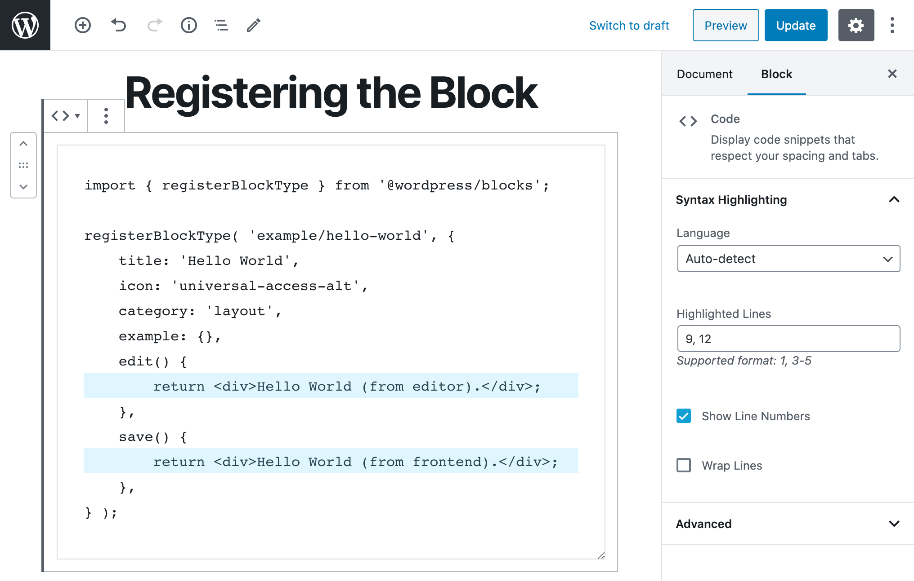

# Syntax-highlighting Code Block (with Server-side Rendering)

Extending the Code block with syntax highlighting rendered on the server, thus being AMP-compatible and having faster frontend performance.

**Contributors:** [westonruter](https://profiles.wordpress.org/westonruter), [allejo](https://profiles.wordpress.org/allejo)  
**Tags:** [block](https://wordpress.org/plugins/tags/block), [code](https://wordpress.org/plugins/tags/code), [code syntax](https://wordpress.org/plugins/tags/code-syntax), [syntax highlight](https://wordpress.org/plugins/tags/syntax-highlight), [code highlighting](https://wordpress.org/plugins/tags/code-highlighting)  
**Requires at least:** 5.6  
**Tested up to:** 6.2  
**Stable tag:** 1.4.0  
**License:** [GPLv2 or later](http://www.gnu.org/licenses/gpl-2.0.html)  
**Requires PHP:** 5.6

## Description

This plugin extends the Code block in WordPress core to add syntax highlighting which is rendered on the server. Pre-existing Code blocks on a site are automatically extended to include syntax highlighting. Doing server-side syntax highlighting eliminates the need to enqueue any JavaScript on the frontend (e.g. Highlight.js or Prism.js) and this ensures there is no flash of unhighlighted code (FOUC?). Reducing script on the frontend improves frontend performance and it also allows for the syntax highlighted code to appear properly in AMP pages as rendered by the [official AMP plugin](https://amp-wp.org) (see also [ampproject/amp-wp#972](https://github.com/ampproject/amp-wp/issues/972)) or when JavaScript is turned off in the browser.

In addition to not adding any JavaScript to the frontend, the stylesheets needed for styling the Code block will only be added to the page if there is a Code block present. The stylesheets are added inline when the Code block is rendered, ensuring that they do not block rendering of any content higher in the page. If stylesheets fail to load for any reason, the block simply renders without styling, with one key exception: highlighted lines are wrapped in [`mark` elements](https://developer.mozilla.org/en-US/docs/Web/HTML/Element/mark) so they'll get highlighted regardless, including in RSS Feeds and posts syndicated in email (as long as the `mark` element is supported in the client).

This extended Code block uses language auto-detection to add syntax highlighting, but you can override the language in the block's settings sidebar. (There is currently no syntax highlighting of the Code block in the editor.) The plugin supports all [programming languages](https://highlightjs.org/static/demo/) that [highlight.php](https://github.com/scrivo/highlight.php) supports (being a port of [highlight.js](https://highlightjs.org/)). The Code block also is extended to support specifying the aforementioned highlighted lines. There is also a checkbox for whether to show line numbers on the frontend (with the numbers being non-selectable). Lastly, given inconsistencies across themes as to whether lines in a Code block should be wrapped, this plugin adds styling to force them to no-wrap by default, with a checkbox to opt-in to wrapping when desired.

For advanced usage, please see the [plugin wiki](https://github.com/westonruter/syntax-highlighting-code-block/wiki).

This plugin is [developed on GitHub](https://github.com/westonruter/syntax-highlighting-code-block). See [list of current issues](https://github.com/westonruter/syntax-highlighting-code-block/issues) with the plugin. Please feel free to file any additional issues or requests that you may come across. [Pull requests](https://github.com/westonruter/syntax-highlighting-code-block/pulls) are welcome. See [contributing information](https://github.com/westonruter/syntax-highlighting-code-block/wiki/Contributing).

### Credits

This is a fork of [Code Syntax Block](https://github.com/mkaz/code-syntax-block) by [Marcus Kazmierczak](https://mkaz.blog/) (mkaz), which is also [available on WordPress.org](https://wordpress.org/plugins/code-syntax-block/). Copyright (c) 2018 Marcus Kazmierczak. Licensed under GPL 2.0 or later.

[highlight.php](https://github.com/scrivo/highlight.php) is released under the BSD 3-Clause License. Copyright © 2006-2013, Ivan Sagalaev (maniac@softwaremaniacs.org), highlight.js (original author). Copyright © 2013, Geert Bergman (geert@scrivo.nl), highlight.php

## Screenshots

### Code blocks can be added as normal, optionally overriding the auto-detected language. Also specify any lines to be highlighted, whether to show line numbers, and if the lines should wrap.

### The Code block renders with syntax highlighting on the frontend without any JavaScript enqueued. Stylesheets are added only when block is on the page.

## Changelog

For the plugin’s changelog, please see [the Releases page on GitHub](https://github.com/westonruter/syntax-highlighting-code-block/releases).

